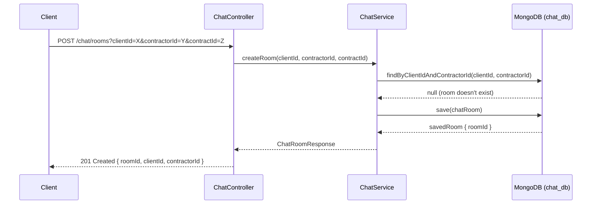
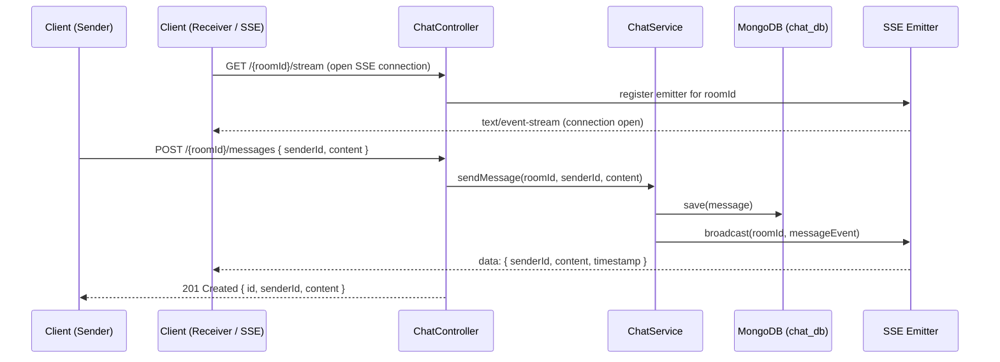
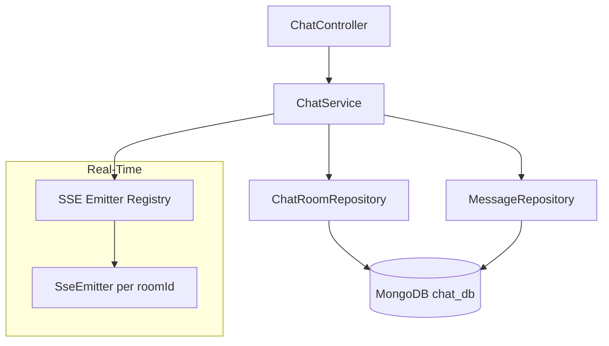

# 💬 Chat Service

Microservice responsible for real-time messaging between clients and contractors in the Clean Pro Solutions platform. Uses Server-Sent Events (SSE) for real-time message delivery without WebSocket overhead.

---

## 📋 Service Info

| Property     | Value                       |
|--------------|-----------------------------|
| Port         | `8091`                      |
| Database     | MongoDB — `chat_db`         |
| RabbitMQ     | Not used for events         |
| Registry     | Eureka (`chat-service`)     |

---

## 🔄 Main Flow — Sequence Diagrams

### Chat Room Creation



### SSE Message Flow (Real-Time)



---

## 🏗️ Internal Architecture



---

## 📡 API Endpoints

| Method | Path                    | Request Body / Params                                    | Response                     |
|--------|-------------------------|----------------------------------------------------------|------------------------------|
| POST   | `/chat/rooms`           | `?clientId=X&contractorId=Y&contractId=Z` (query params) | `201 ChatRoomResponse`       |
| GET    | `/{roomId}/stream`      | —                                                        | SSE stream (`text/event-stream`) |
| POST   | `/{roomId}/messages`    | `{ senderId, content }`                                  | `201 MessageResponse`        |
| GET    | `/{roomId}/messages`    | —                                                        | `200 [ MessageResponse ]`    |

> **Note:** The SSE endpoint (`/{roomId}/stream`) keeps an open HTTP connection and pushes new messages as `data:` events. Clients must handle `text/event-stream` content type.

---

## ⚙️ Environment Variables

| Variable                    | Description              | Default                                    |
|-----------------------------|--------------------------|--------------------------------------------|
| `SPRING_DATA_MONGODB_URI`   | MongoDB connection URI   | `mongodb://localhost:27017/chat_db`        |
| `EUREKA_SERVER_URL`         | Eureka registry URL      | `http://localhost:8761/eureka`             |

---

## 🚀 Build & Run

### Build
```bash
mvn clean install
```

### Run locally
```bash
mvn spring-boot:run
```

### Run with Docker Compose
```bash
docker-compose up chat-service
```

---

## 🧪 How to Test

### Create a chat room
```bash
curl -X POST "http://localhost:8091/chat/rooms?clientId=64a1b2c3d4e5f6a7b8c9d0e1&contractorId=64a1b2c3d4e5f6a7b8c9d0e2&contractId=64a1b2c3d4e5f6a7b8c9d0e5"
```

### Listen to SSE stream (open in one terminal)
```bash
curl -N http://localhost:8091/abc123roomId/stream
```

### Send a message (in another terminal)
```bash
curl -X POST http://localhost:8091/abc123roomId/messages \
  -H "Content-Type: application/json" \
  -d '{
    "senderId": "64a1b2c3d4e5f6a7b8c9d0e1",
    "content": "Olá! Confirmo o horário das 9h."
  }'
```

### Get message history
```bash
curl http://localhost:8091/abc123roomId/messages
```

---

## 🗂️ Project Structure

```
clean-pro-solutions-chat-service/
├── src/main/java/
│   └── com/cleanpro/chat/
│       ├── controller/     # REST + SSE endpoints
│       ├── service/        # Chat room & message logic
│       ├── repository/     # MongoDB repositories
│       ├── dto/            # Request/Response records
│       ├── model/          # ChatRoom & Message entities
│       ├── config/         # SSE emitter config
│       └── exception/      # Custom exceptions
├── src/test/
└── pom.xml
```

---

© 2026 Clean Pro Solutions — Developed by **Emerson Lima**
